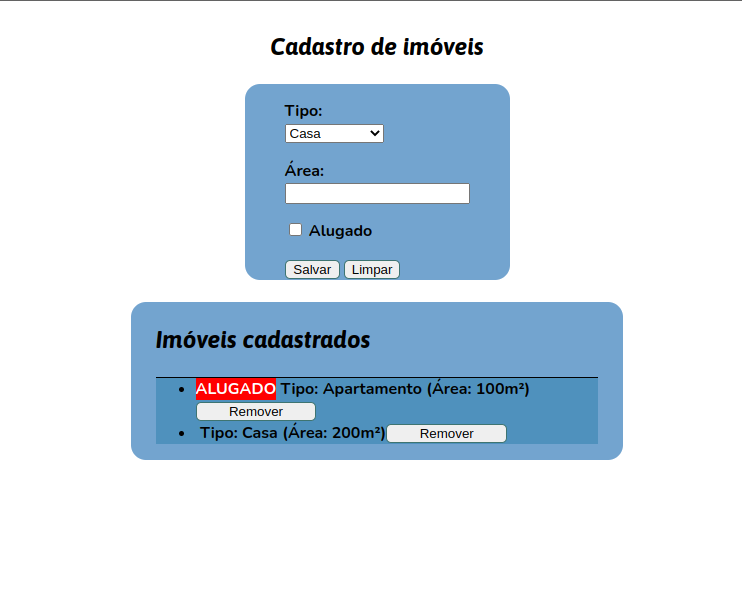

# Aplicação Web Com JavaScript

## Table of contents

- [Overview](#overview)
  - [The challenge](#the-challenge)
  - [Screenshot](#screenshot)
- [My process](#my-process)
  - [Built with](#built-with)
  - [What I learned](#what-i-learned)
  - [Useful resources](#useful-resources)
- [Author](#author)


## Overview

## Description

- Esta aplicação WEB é resultado do curso que estou fazendo sobre JavaScript, e isso foi o tema uma aula 
e essa é a minha resolução.
Fizemos um sistema de cadastro de imóveis para uma corretora.
Uma corretora solicitou um sistema onde ela pudesse cadastrar imóveis para serem exibidos aos seus 
clientes. Para cadastrar um imóvel, é necessário passar as seguintes informações: informar o tipo (se
é casa ou apartamento) a área e ser está alugado.
Após o cadastro do imóvel o formulário é limpo para o próximo cadastro.
Abaixo deste formulário, tem uma lista com os imóveis que já foram cadastrados e esta lista é 
atualizada assim que o imóvel é criado no formulário. 
A corretora também pode remover um imóvel cadastrado previamente clicando num botão na lista de 
imóveis.

- Para fazer isso tudo, usamos conteúdos que estávamos aprendendo, por exemplo:
Classes
Manipulação de DOM
Chamada, eventos a partir do HTML
e brinquei com um pouco de css no meio do projeto.

- Fique a vontade para testar.

### The challenge

Usuários devem ser capazes de:

- A corretora pode cadastrar imóveis para serem exibidos aos seus clientes. Podemos selecionar o tipo do imóvel e também a área e se ele está alugado. Abaixo teremos uma lista que irá mostrar todos os dados que colocamos no formulário.

### Screenshot



## My process

### Built with

- Semantic HTML5 markup
- CSS custom properties
- Flexbox
- JavaScript


### What I learned

```js
addOnPropertiesList(property) {
    let listElement = document.createElement("li")
    let propertyInfo = " Tipo: " + property.kind + " (Área: " + property.area + "m²)"
    if (property.rented) {
        let rentedMark = this.createRentedMark()
        listElement.appendChild(rentedMark)
    }
    listElement.innerHTML += propertyInfo
    let buttonToRemove = this.createRemoveButton()
    listElement.appendChild(buttonToRemove)
    document.getElementById("properties").appendChild(listElement)
    }
```

### Useful resources

- [Curso que estou fazendo no momento](https://programador.onebitcode.com/) - Este, app foi resolução de um exercício que tive no curso.

## Author

- Instagram - [@ogdrian](https://www.frontendmentor.io/profile/yourusername)
- Linkedin - [@AdrianoEscarabote](https://www.linkedin.com/in/adriano-escarabote-944b02233/)
